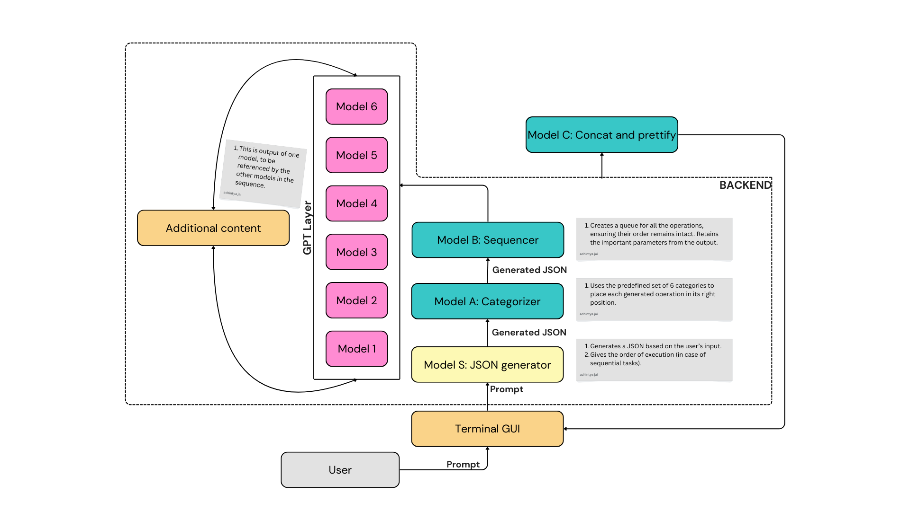
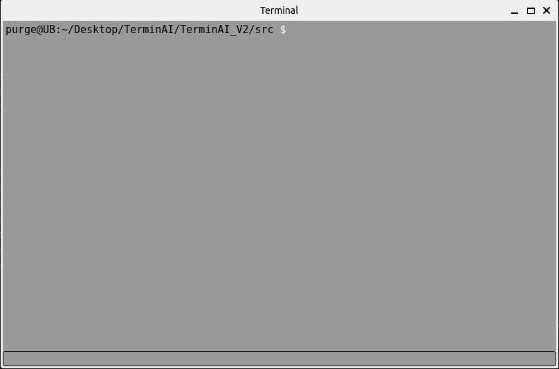

# TerminAI_V2

A python based terminal with AI capabilities. Forget commands, just tell it what it do!

# Things we can add

- [ ] Consider adding functionality to execute normal linux commands without having to pass it through the models.
- [x] Make sure that `response` is printed as "output: something" or "-> something" etc. Make it look better.
- [x] Remove the unnecessary delays please!
- [ ] If the operating system is windows or mac, then generate that relevant command
- [ ] Create a setup file that can be referenced by the models

- [ ] Implement history!

# Framework 

This is the third draft of TerminAI. This is without history implementation.

# Terminal

This is the terminal

# To install

Run the following command to install the dependencies

		pip install -r requirements.txt

Ensure that you create a `.env` file (cause mine is in `gitignore` for obvious reasons). The format you need to follow is this

		API_KEY=<your_api_key_here>
		SUPABASE_URL=<your_supabase_url_here>
		SUPABASE_KEY=<your_supabase_key_here>

For history implementation you will have to create a supabase table and add the credentials in the `.env` file.

## Completed work

- [x] Created os environment for the API keys.
- [x] Created the json model framework.
- [x] Figure out how to import files present in other directories.
- [x] Write prompts for the json model.
- [x] Test terminal with the model.

---

If it becomes too heavy for your computer to run all these models along with other systems in parallel, you can use the resources of a workstation and run this in your own computer! (Coming out soon)

---

The way we get the execution order working, we execute the first command, and get the output, then use that to execute the second command and so on.
