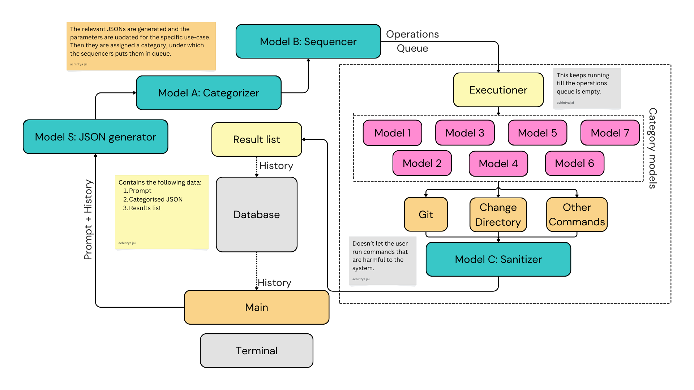

# TerminAI_V2

  
  
  

A python based terminal with AI capabilities. Forget commands, just tell it what it do!

# Things we have to add

---
Priorities

- [ ] Consider adding functionality to execute normal linux commands without having to pass it through the models.
- [ ] We'll have to handle `git` and `cd` seperately from others. 

---

- [ ] Introduce verbose outputs for installing things.
- [ ] Test the changing of commands in different operating systems... For windows bypass execution policy first

---

# Framework 

This is the fifth draft of TerminAI. This is with history implementation.

# Terminal

This is the terminal

# Installing the terminal 

### Linux

Ensure that python, pip and git are installed

		sudo apt update && sudo apt-get install python3
		sudo apt-get install python3-pip
		sudo apt install git

Then clone the GitHub repo locally. Now you can start installing the dependencies.

		git clone https://github.com/pUrGe12/TerminAI_V2.git && cd TerminAI_V2

### Windows 

If winget is installed then run the following command to install python

		winget install -e --id Python.Python.3

Else install python via [python.org](https://www.python.org/downloads). Make sure to add it to the path variables. Note that pip comes installed with python versions 3.4 and above.

Install git using (if no winget then use the [git_website](https://git-scm.com))

		winget install -e --id Git.Git

Then run the following command to clone the it locally,

		git clone https://github.com/pUrGe12/TerminAI_V2.git && cd TerminAI_V2

### MacOS

Install homebrew (mac’s package manager) and python

		/bin/bash -c "$(curl -fsSL https://raw.githubusercontent.com/Homebrew/install/HEAD/install.sh)" && brew install python

Install git and clone the repo

		brew install git && git --version
		git clone https://github.com/pUrGe12/TerminAI_V2.git && cd TerminAI_V2

## Setup

The setup is easy, you are required to obtain 

- [x]  Gemini API keys from over here.
- [x] Create a database over at supabase and get the URL and KEY (the anon public one).

Then you’re required to copy the SQL query over at [table_creation](./utils/setup/table_creation.sql) and run that in the SQL editor of your database.

For Linux and Mac users, run the [setup.sh](./utils/setup/setup.sh) which will take care of the other things using the command below and enter the data whenever required.

For Windows users, execute the PowerShell script [setup.ps1](./utils/setup/setup.ps1) and enter the data whenever required. 

Note for Windows users, you will need to bypass the execution policy to be able to use TerminAI at all (because Windows doesn’t allow command execution by normal users). Use the below command as an administrator in the PowerShell.l

		Set-ExecutionPolicy -Bypass -Scope Process

## Requirements and dependencies

It is advisable to install the dependencies in a python virtual environment to avoid version clashes.

Run the following commands to achieve that:

		python3 -m venv VirtTerminal

Activate it using the following commands

### Linux/Mac:		 	

		source VirtTerminal/bin/activate

### Windows (PowerShell):	 

		.\VirtTerminal\Scripts\Activate 

Install the necessary dependencies (in the root of the repo).

		pip install -r requirements.txt

## Run

To run the terminal,

		python3 src/main.py

you may need to export wayland to get a better UI, do that using

		export QT_QPA_PLATFORM=wayland

---